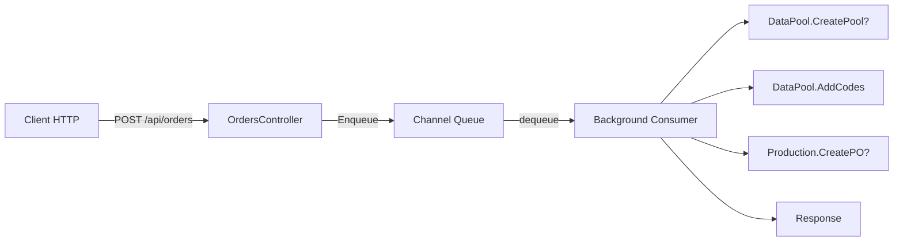

## Kế hoạch triển khai HTTP API cho DMS_Project

### 1. Tạo OrderModels.cs

**File:** `DMS_Project/Communications/Orders/OrderModels.cs`

```csharp
public class OrderRequest
{
    public string OrderNo { get; set; }
    public string GTIN { get; set; }
    public string BlockNo { get; set; }
    public List<string> UniqueCodes { get; set; }
    public string Site { get; set; }
    public string Factory { get; set; }
    public string ProductionLine { get; set; }
    public string ProductionDate { get; set; }
    public string Shift { get; set; }
    public int OrderQty { get; set; }
    public string LotNumber { get; set; }
    public string ProductCode { get; set; }
    public string ProductName { get; set; }
    public string CustomerOrderNo { get; set; }
    public string Uom { get; set; }
}

public class OrderResponse
{
    public bool Success { get; set; }
    public string Message { get; set; }
    public string OrderNo { get; set; }
    public int InsertedCount { get; set; }
    public int DuplicateCount { get; set; }
    public int TotalCodes { get; set; }
    public int ReceiveQty { get; set; }
    public DateTime At { get; set; }
}
```

### 2. Tạo OrderQueueService.cs (Background Consumer)

**File:** `DMS_Project/Communications/Orders/OrderQueueService.cs`

- Sử dụng `Channel<OrderRequest>` để buffer requests
- Background consumer xử lý tuần tự
- Tích hợp với `DataPool` và `Production`

```csharp
public class OrderQueueService : BackgroundService
{
    private readonly Channel<OrderRequest> _channel;
    
    public async Task EnqueueAsync(OrderRequest request);
    protected override async Task ExecuteAsync(CancellationToken stoppingToken);
}
```

### 3. Tạo OrdersController.cs

**File:** `DMS_Project/Controllers/OrdersController.cs`

```csharp
[ApiController]
[Route("api/orders")]
public class OrdersController : ControllerBase
{
    private readonly OrderQueueService _queueService;
    
    [HttpPost]
    public async Task<IActionResult> CreateOrUpdateOrder([FromBody] OrderRequest request);
}
```

### 4. Logic xử lý Order (giống Server_Service)

```
1. Validate request (required fields, orderQty > 24)
2. Kiểm tra Pool theo GTIN (từ DataPool)
3. Nếu Pool chưa có → tạo mới (DataPool.CreatePool)
4. Thêm codes vào Pool (DataPool.AddCodes với blockNo)
5. Kiểm tra PO theo OrderNo (từ Production)
6. Nếu PO chưa có → tạo mới (Production.CreatePO)
7. Trả kết quả về cho client
```

### 5. Đăng ký service trong Program.cs

```csharp
builder.Services.AddSingleton<OrderQueueService>();
builder.Services.AddHostedService(sp => sp.GetRequiredService<OrderQueueService>());
```

### 6. Cấu trúc thư mục cuối cùng

```
DMS_Project/
├── Controllers/
│   ├── OrdersController.cs      (mới)
│   ├── ProductionController.cs (đã có)
│   └── DataPoolController.cs    (đã có)
├── Communications/
│   └── Orders/
│       ├── OrderModels.cs       (mới)
│       └── OrderQueueService.cs (mới)
```

### 7. API Endpoint

```
POST /api/orders
Content-Type: application/json

{
    "orderNo": "PO001",
    "gtin": "GT001",
    "blockNo": "B001",
    "uniqueCodes": ["C1", "C2", "C3"],
    "site": "SITE_MASAN",
    "factory": "FACTORY_01",
    "productionLine": "LINE_1",
    "productionDate": "2026-08-06",
    "shift": "A",
    "orderQty": 100,
    "lotNumber": "LOT_001",
    "productCode": "PROD_XYZ",
    "productName": "San pham A",
    "customerOrderNo": "CUST_001",
    "uom": "PCS"
}
```

---

### Tóm tắt luồng Channel



**Ưu điểm Channel:**
- Non-blocking → client không bị chờ xử lý
- Buffer unbounded → không miss data
- Thread-safe → multi-client
- FIFO → đúng thứ tự xử lý
